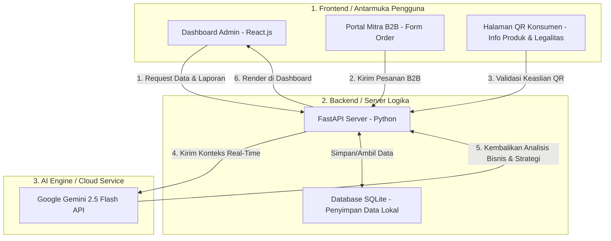

# ELPIS Smart Supply-Demand: Portal Manajemen Bisnis & Peramalan Produksi Berbasis AI

Selamat datang di repositori **ELPIS Smart Supply-Demand**.

## Ringkasan Eksekutif Startup (Untuk Pitching)
**Elpis** adalah startup produk makanan ringan (olahan ikan Depik kering khas Danau Laut Tawar, Takengon, Aceh Tengah) dengan varian rasa: *Original, Pedas, dan Balado (Kemasan Standing Pouch 150g)* seharga **Rp 30.000/pcs**.

**Masalah Bisnis Utama (Pain Points):**
1. **Ketidakpastian Pasokan & Fluktuasi Harga**: Ikan Depik adalah ikan endemik musiman yang pasokannya tidak stabil di Takengon.
2. **Risiko Kerugian Ganda**: 
   - *Overproduction* (kelebihan produksi) membuat ikan cepat tengik/rusak (membuang biaya HPP).
   - *Underproduction* (kekurangan stok) membuat kehilangan peluang omzet penjualan ritel dan B2B.
3. **Pencatatan Keuangan Manual**: Sulit memantau margin laba kotor, HPP, arus kas, dan neraca secara real-time.

**Solusi ELPIS Smart Supply-Demand:**
Sistem digital terintegrasi yang menghubungkan **pencatatan transaksi (B2C & B2B)**, **manajemen stok gudang bahan baku**, dan **teknologi Kecerdasan Buatan (AI Gemini 2.5 Flash)** untuk memprediksi kebutuhan produksi serta memberikan rekomendasi bisnis strategis secara otomatis.

---

## 🛠️ Arsitektur Teknologi & Integrasi Sistem

Sistem ini menggunakan arsitektur **Client-Server modern** yang digambarkan secara visual menggunakan diagram alir di bawah ini.

### Diagram Arsitektur (Menggunakan Sintaks Mermaid)

Di bawah ini adalah kode pemrograman diagram **Mermaid**. Mermaid adalah teknologi penulisan diagram berbasis teks dalam file Markdown yang otomatis diterjemahkan oleh GitHub/VS Code menjadi bagan alir visual.



---

### 2. Penjelasan Komponen Utama Sistem (Teknis Formal)

#### Frontend (Sisi Klien / Client-Side)
*   **Teknologi**: **React.js** (Library JavaScript untuk UI), **Vite** (Build tool untuk performa render cepat), **Lucide React** (Ikon), dan **Recharts** (Grafik interaktif).
*   **Fungsi**: Berjalan di browser pengguna. Bertugas menerima input data transaksi dari admin, mengirim formulir order dari mitra B2B, dan menampilkan visualisasi grafik performa omzet bisnis secara real-time.

#### Backend (Sisi Server / Server-Side)
*   **Teknologi**: **FastAPI (Python)** dan **SQLAlchemy** (Object Relational Mapper untuk komunikasi database).
*   **Fungsi**: Berjalan di server lokal/cloud pribadi. Bertugas memproses semua permintaan dari frontend, menangani keamanan sistem (login/logout), menghitung perhitungan matematika akuntansi (HPP, laba kotor, depresiasi aset, neraca), dan memanggil API Gemini.

#### Database SQLite (Penyimpanan Data Lokal)
*   **Teknologi**: **SQLite** (Sistem Manajemen Database Relasional / RDBMS).
*   **Fungsi**: Menyimpan data terstruktur (tabel produk, tabel transaksi penjualan, data mitra B2B) ke dalam satu file database lokal (`elpis.db`). Keunggulannya adalah *Local-First*—tidak memerlukan server cloud berbayar dan data keuangan internal sangat aman dari pencurian data online pihak ketiga.

#### AI Engine (Kecerdasan Buatan / Cloud Integration)
*   **Teknologi**: **Google Gemini 2.5 Flash API** (Akses Cloud ke Model AI Google).
*   **Fungsi**: Memproses analisis tingkat lanjut. Backend akan mengirimkan ringkasan data penjualan dan stok ke Gemini API, lalu Gemini akan mengembalikan rekomendasi taktis bisnis yang siap dibaca oleh admin pada halaman dasbor.

---

### 2. Konsep Teknis Penting untuk Juri (Wajib Dikuasai)

Jika Juri bertanya tentang cara kerja AI atau keamanan sistem, gunakan 3 poin penjelasan teknis berikut:

#### A. Konsep RAG (Retrieval-Augmented Generation) Sederhana
> *"Sistem kami tidak sekadar bertanya ke Gemini secara buta. Sebelum backend mengirim pertanyaan pengguna ke Gemini API, backend kami melakukan **Retrieval (penarikan data lokal)** terlebih dahulu ke database SQLite untuk mengambil fakta riil: berapa sisa ikan depik di gudang, apa saja event minggu depan, dan varian apa yang paling laris. Seluruh data mentah ini dikemas ke dalam amplop konteks dan dikirim ke Gemini. Teknik ini menjamin jawaban AI **100% akurat sesuai kondisi nyata bisnis Elpis** dan bebas dari halusinasi data."*

#### B. Optimasi Token & Kecepatan Berpikir (`thinkingBudget: 0`)
> *"Untuk menghemat biaya kuota token API gratis dan mempercepat respons, kami menerapkan konfigurasi **Zero-Thinking Budget** pada Gemini 2.5 Flash. Kami mematikan modul penalaran internal (*thinking tokens*) yang memakan waktu dan kuota, karena analisis bisnis kami sudah disediakan dalam bentuk data terstruktur yang dikirim dari database lokal. Hasilnya, AI merespons 3 detik lebih cepat dan menghemat konsumsi kuota token hingga 35% per panggilan."*

#### C. Ketahanan Offline (*Offline Resilience*)
> *"Sistem Elpis dirancang dengan prinsip **Local-First**. Seluruh transaksi penjualan, manajemen gudang bahan baku, kalkulasi HPP otomatis, neraca, dan rumus peramalan produksi dasar diproses secara lokal di server backend kami tanpa internet. Internet hanya diperlukan ketika pengguna ingin berkonsultasi interaktif dengan 'Elpis AI Advisor' (API Gemini). Jika jaringan internet di Takengon putus, operasional bisnis utama di toko tetap berjalan 100% normal."*

---

## Rumus Finansial & Logika Peramalan (Wajib Dipahami untuk Proposal/Presentasi)

Juri biasanya akan bertanya: *"Bagaimana angka-angka keuangan dan prediksi produksi di dasbor Anda didapatkan?"*

### A. Rumus Struktur Keuangan Elpis (Standar Akuntansi Bisnis)
1.  **Harga Pokok Penjualan (HPP)**: Ditetapkan secara ketat sebesar **65,2%** dari total omzet penjualan kotor berdasarkan kalkulasi historis bahan baku ikan Depik, minyak, bumbu, dan kemasan.
2.  **Laba Kotor (Gross Profit)**:
    $$\text{Laba Kotor} = \text{Total Omzet} - \text{Total HPP}$$
3.  **Beban Operasional Bulanan**:
    - Perlengkapan Kantor: **1,6%** dari omzet kotor.
    - Depresiasi Peralatan Masak: **Rp 130.540/bulan** (penyusutan aset).
    - Biaya Operasional Lain-lain: **Rp 500.000/bulan** (gas, transportasi, listrik).
4.  **Laba Bersih (Net Profit)**:
    $$\text{Laba Bersih} = \text{Laba Kotor} - \text{Total Beban Operasional}$$
5.  **Neraca Keuangan (Balance Sheet)**:
    - **Total Aset**: Penjumlahan dari Laba Bersih + Nilai Stok Produk (dihitung berbasis HPP) + Nilai Buku Peralatan (Peralatan Awal - Depresiasi) + Aset Hak Kekayaan Intelektual (HKI Merek senilai Rp 750.000).

### B. Algoritma Peramalan Kebutuhan Produksi (Heuristic Demand Forecasting)
Sistem menggunakan metode peramalan berbasis **Koefisien Tren dan Kalender Event Promosi** untuk memproyeksikan kebutuhan minggu depan:
1.  **Baseline Permintaan Mingguan**: Menghitung rata-rata penjualan riil 7 hari terakhir per varian rasa.
2.  **Multiplier Dampak Event**: Jika ada event promosi aktif terdaftar (misal *Car Free Day Banda Aceh* dengan koefisien pengaruh **1.8** atau *Expo Mahasiswa* dengan koefisien **2.0**), baseline permintaan akan dikalikan dengan koefisien tersebut.
3.  **Rekomendasi Produksi Bersih**:
    $$\text{Rekomendasi Produksi} = (\text{Baseline Permintaan} \times \text{Multiplier Event}) - \text{Stok Produk Jadi Saat Ini}$$
    *(Hasil akhir dibulatkan ke atas untuk memastikan ketersediaan barang).*
4.  **Kebutuhan Bahan Baku**: Hasil rekomendasi produksi otomatis dikonversi ke kebutuhan bahan baku riil:
    - **Ikan Depik Kering**: Membutuhkan **0,08 kg (80 gram)** ikan per pcs kemasan.
    - **Kemasan Standing Pouch**: Membutuhkan **1 pcs** kemasan per pcs produk.

---

## Kunci Jawaban Pertanyaan Juri (Cheat Sheet Presentasi)

Berikut adalah kompilasi pertanyaan yang paling sering diajukan juri saat presentasi startup teknologi dan cara Anda menjawabnya sebagai mahasiswa manajemen:

#### Q1: "Kenapa startup kuliner skala mikro seperti Elpis butuh teknologi AI? Bukankah cukup pakai Microsoft Excel?"
> **Jawaban:** 
> "Excel bersifat statis dan reaktif—kita baru tahu stok habis setelah benar-benar habis. Sistem Elpis mengintegrasikan data stok secara *real-time* dengan AI Gemini 2.5 Flash untuk bertindak secara **proaktif**. AI tidak hanya menampilkan angka, tetapi memberikan interpretasi naratif langsung: memperingatkan jika bahan baku kritis sebelum produksi terhambat, menghitung dampak event promosi mendatang secara otomatis, dan memberikan saran strategi pemasaran berdasarkan varian produk yang paling cepat berputar. Ini menghemat waktu analisis kami sebagai pemilik bisnis."

#### Q2: "Bagaimana cara kerja AI Gemini di sistem Anda? Apakah modelnya dilatih dari awal (custom-trained)?"
> **Jawaban:**
> "Tidak, kami tidak melatih ulang model Gemini dari nol karena hal itu membutuhkan biaya komputasi yang sangat mahal (tidak efisien bagi startup tahap awal). Kami menggunakan metode **Context-Based Prompting / In-Context Learning**. Setiap kali kami menanyakan sesuatu pada AI Advisor, backend FastAPI kami otomatis mengambil data stok, transaksi keuangan, dan kalender event promosi terbaru dari database, lalu menyuapinya sebagai *konteks kontekstual* ke API Gemini 2.5 Flash. Dengan cara ini, Gemini menjawab secara super presisi menggunakan data riil bisnis kami tanpa risiko mengarang (*halusinasi*), sekaligus menghemat token dan biaya operasional secara maksimal."

#### Q3: "Bagaimana jika koneksi internet di Takengon tidak stabil? Apakah website Anda akan lumpuh total?"
> **Jawaban:**
> "Sama sekali tidak. Aplikasi kami dirancang dengan prinsip **Local-First & Graceful Degradation**. Seluruh fungsi pencatatan penjualan kotor, pengelolaan stok gudang, perhitungan HPP, neraca keuangan, dan perhitungan rumus peramalan kebutuhan produksi dasar diproses secara lokal di server backend kami tanpa memerlukan internet. Koneksi internet hanya dibutuhkan saat Admin ingin berkonsultasi secara interaktif dengan 'Elpis AI Advisor' (API Gemini). Jika internet terputus, operasional bisnis, pencatatan transaksi, dan peramalan heuristik dasar tetap berjalan 100% normal."

#### Q4: "Bagaimana Anda menjamin keaslian produk Anda melalui QR Code? Apa bedanya dengan QR Code biasa?"
> **Jawaban:**
> "QR Code pada produk Elpis terhubung langsung secara dinamis dengan database sistem kami menggunakan kode SKU unik produk. Konsumen yang memindai QR Code tersebut akan diarahkan ke halaman verifikasi resmi [ProductDetail.jsx](file:///d:/Elpis/FE%20Elpis/src/views/ProductDetail.jsx) yang menampilkan detail transparansi produk: asal bahan baku (Takengon), tanggal produksi, kandungan gizi, status sertifikasi Halal MUI, SPP-IRT, HKI Merek, serta nomor NIB perusahaan. Hal ini membangun *brand trust* yang sangat kuat bagi konsumen modern yang peduli dengan legalitas dan kualitas produk lokal."

#### Q5: "Apa rencana pengembangan (roadmap) teknologi Elpis ke depan?"
> **Jawaban:**
> "Untuk jangka pendek, kami fokus mengoptimalkan portal pesanan B2B untuk mempermudah mitra swalayan melakukan *restock* mandiri yang datanya langsung masuk ke antrean dasbor kami. Untuk jangka panjang, seiring bertambahnya data transaksi bulanan, kami berencana menerapkan model *Machine Learning* sederhana (seperti *Linear Regression* atau *ARIMA*) secara lokal untuk mendukung analisis musiman (*seasonality*) yang lebih mendalam sebelum dilemparkan ke AI untuk interpretasi bisnis strategis."

---

## Cara Menjalankan Project (Untuk Demo di Depan Juri)

Pastikan backend Python dan frontend React berjalan bersamaan saat demo:

### 1. Menjalankan Backend (Python - FastAPI)
1.  Buka terminal baru di folder proyek backend (`d:\Elpis\BE Elpis`).
2.  Aktifkan Virtual Environment:
    ```powershell
    .venv\Scripts\activate
    ```
3.  Jalankan server Uvicorn:
    ```bash
    uvicorn app.main:app --reload
    ```
    *Server backend akan aktif di: `http://127.0.0.1:8000`*

### 2. Menjalankan Frontend (JavaScript - React Vite)
1.  Buka terminal baru di folder proyek frontend (`d:\Elpis\FE Elpis`).
2.  Jalankan server pengembangan Vite:
    ```bash
    npm run dev
    ```
    *Akses website melalui browser di alamat local yang tertera (biasanya `http://localhost:5173`).*

---